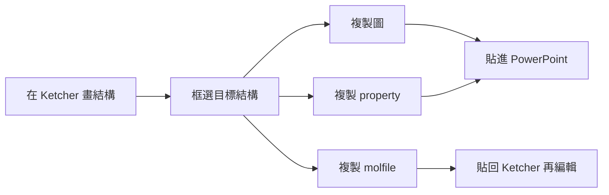

# 結構→PPT 小工具 MVP Spec

Sep 23, 2026 · @Someone

## 背景與目標

MVP 要在瀏覽器裡用一個工具，取代「ChemDraw 框選 → Analysis → 分別複製圖和文字貼進 PPT」的流程。框選結構後，一鍵就能複製圖、property 或 molfile。所有計算都在本機瀏覽器完成，結構不會離開電腦。

## 使用流程



三個按鈕優先針對框選範圍；沒有框選時改為對整張畫布計算。

快捷鍵（左手可及，不與 Ketcher 及瀏覽器的快捷鍵衝突）：Alt+Q 複製圖、Alt+R 複製 property。

畫布右下角有一個小框即時預覽三個 property：有框選時顯示框選範圍，沒有框選時顯示整張畫布，內容與「複製 property」完全相同，編輯結構時會跟著更新。

## 功能需求

| 按鈕 | 輸出內容 | 剪貼簿格式 | 貼上目標 |
| --- | --- | --- | --- |
| 複製圖 | 框選結構的圖，透明背景 | image/png（SVG 貼進 PowerPoint 會變成文字，已放棄） | PowerPoint |
| 複製 property | 三行文字：Formula、Monoisotopic Mass、Average Mass | text/plain | PowerPoint |
| 複製 molfile | V2000 molfile，含 2D 座標 | text/plain | Ketcher（ChemDraw 待測） |

Property 輸出格式，monoisotopic 與 average 都取小數 4 位，比照 ChemDraw（average 用 ChemDraw 的原子量表，例如 C 12.0107、H 1.00794、O 15.9994）：

```
Formula: C10H8O
Monoisotopic Mass: 144.0575
Average Mass: 144.1699
```

部分框選時不補 H：只計入所選原子本身帶的 H，例如只框阿斯匹靈的苯環得到 C6H4（不是 C6H6）。

## 技術架構

純前端網頁，不需要後端：React 頁面嵌入 ketcher-react，搭配 ketcher-standalone（Indigo WASM）在瀏覽器內計算。部署在 GitHub Pages，授權為 Apache 2.0（與 Ketcher 相同）。

- 不 fork Ketcher，三個功能做在外層元件，並鎖定 Ketcher 版本。
- 選取範圍：從 editor 取得選取的原子與鍵，複製成子結構，再序列化成 molfile；沒有選取時直接取整張畫布的結構。
- 圖：用 Ketcher 的 `generateImage` 輸出 SVG，再轉成透明背景 PNG。
- Property：從 Ketcher 的結構讀取所選原子與各自的 H 數，自行計算 formula 與質量。`indigo.calculate` 會對框選片段補 H，平均原子量表也和 ChemDraw 不同，所以不直接使用；monoisotopic 的元素質量取自 Indigo。
- 剪貼簿：Async Clipboard API。

## 風險與驗收

最大的風險是 SVG 能不能從剪貼簿直接貼進公司版本的 PowerPoint，要先做 spike 驗證再做其他部分。

待驗證風險：

1. SVG 剪貼簿貼進 PowerPoint：已實測，貼上為一串文字，改用透明 PNG。
2. 質量值與 ChemDraw 一致：確認用的是 monoisotopic 而非 most-abundant mass，並檢查部分選取、帶電物種、縮寫基團。
3. ChemDraw 是否接受貼上 molfile 文字：不行的話，後續版本加 SMILES。
4. 選取範圍用到 Ketcher 內部 API，升級時可能失效。

驗收標準：

- [ ] 框選結構複製圖後，在 PowerPoint 貼上為透明背景的 PNG 圖
- [ ] 阿斯匹靈的 formula 與兩個質量值跟 ChemDraw 一致：C9H8O4、Monoisotopic Mass 180.0423、Average Mass 180.1574
- [ ] 複製的 molfile 貼回 Ketcher，結構與排版不變
- [ ] 斷網狀態下三個功能都能正常使用

## MVP 範圍外

- 向量圖輸出（SVG 貼進 PowerPoint 會變成文字）
- 結構尺寸一致（固定鍵長輸出）
- Formula 下標格式
- 在 PowerPoint 內直接雙擊回到編輯（ChemDraw 式內嵌物件）
- molfile 的保存位置，例如匯出歷史紀錄
- SMILES 等其他格式輸出
